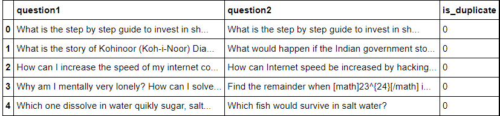
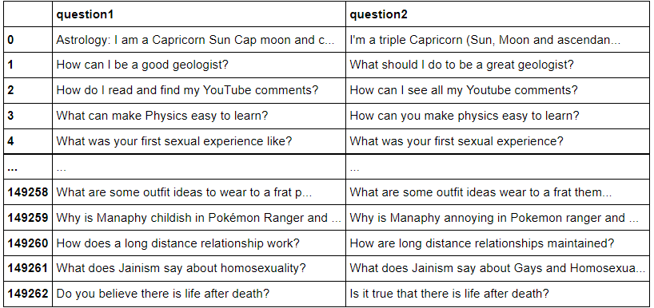
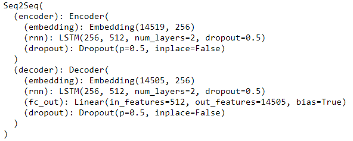
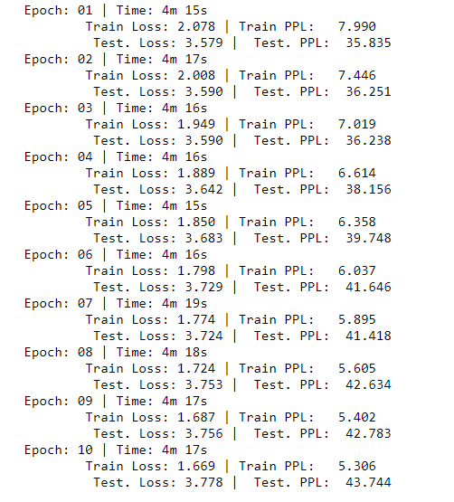
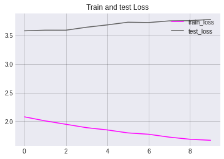
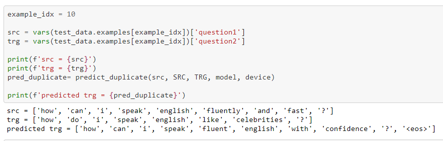
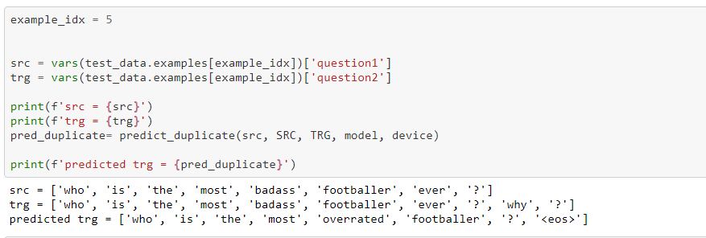
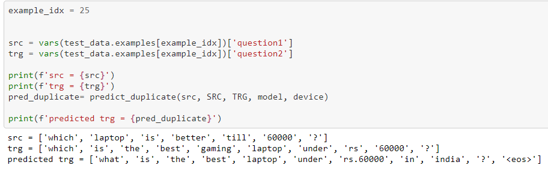

# Duplicate Question Prediction with Quora Dataset 

## Introduction

Here we will be building a sequence to sequence deep learning model for the prediction of duplicate questions. Sequence to Sequence (seq2seq) model here uses an encoder-decoder architecture. Encoder neural network encodes the input sequence(question) into a single vector, also called a Context Vector, which is an abstract representation of the input sequence. This vector is then passed into the decoder neural network, which is used to output the corresponding output sequence (duplicate question), one word at a time

## Dataset

We will be using the first public dataset of Quora released in January 2017. The Quora dataset consists of a large number of question pairs and a label that mentions whether the question pair is logically duplicate or not. For example, the two questions below carry the same intent.

*“What is the most populous state in the USA?”*

*“Which state in the United States has the most people?”*

Ideally, only one of the two should be present on Quora.

The data set consisted of around 400,000 pairs of questions organized in the form of 4 columns as explained -

- id: Row ID
- question 1, question 2: The actual textual contents of the questions.
- is_duplicate: Label is 0 for questions which are semantically different and 1 for questions which essentially would have only one answer (duplicate questions)

63% of the questions pairs are semantically non-similar and 37% are duplicate questions pairs. We will consider only questions with duplicates for our modeling

Raw data is as shown below :

We will do some preprocessing ,remove all non duplicate entries and unwanted columns from our dataset

After preprocessing final train dataset look like following

We have 149262 question pairs ,which we randomly split further into train and test set in 70:30 ratio. Finally we have 104484 train samples and 44779 test samples

### Model

Sequence to Sequence (seq2seq) model here uses an encoder-decoder architecture. Encoder neural network encodes the input sequence(question) into a single vector, also called as a Context Vector,which is an abstract representation of the input sequence. This vector is then passed into the decoder neural network, which is used to output the corresponding output sequence (answer), one word at a time. Model  and parameters are as follows :

Parameters:

- Encoder Embedding_dim = 256

- Decoder Embedding_dim = 256

- Hidden_nodes = 512

- Output_nodes = 5

- Number of layers = 2

- Encoder Dropout = 0.5

- Decoder Dropout = 0.5

  

Optimizer:  `Adam` adapts the learning rate for each parameter, giving parameters that are updated more frequently lower learning rates and parameters that are updated infrequently higher learning rates.

Loss function : `CrossEntropyLoss`

Epochs :10

### Results

###### Train and test logs

###### Train and test loss 

|       | Loss      | Perplexity |
| ----- | --------- | ---------- |
| Train | 1.665.306 | 5.3        |
| Test  | 3.778     | 43.77      |

###### Predictions

